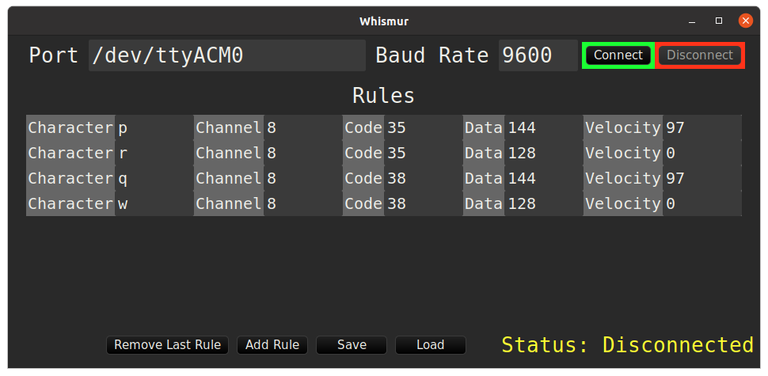

# Whismur


## Description

Whismur is a small application written in Rust using [druid](https://github.com/linebender/druid) to create a bridge between a serial port and a Jack MIDI Port. Very useful for controlling MIDI devices/creating sounds using your arduino.

## How It Works

Just program your arduino to print to the serial port, for example [this](#arduino-example-code) code, and configure whismur to listen to the arduino serial port. Whismur listen for the characters you configure in the GUI and send a MIDI event when the arduino print these characters.

I personally use Whismur for connecting two pedals to my arduino and sending a kick/snare drums events.



## Installation

For linux, download the prebuilt binaries available in the [releases](https://github.com/DanielSanRocha/whismur/releases) page. For other OSs, build it from source.

## Running

Just give permission to the binary to run and run it
```bash
chmod +x {NAME OF THE BINARY}
./{NAME OF THE BINARY}
```
You can add the binary to a path in your PATH environment variables so you can run it from anywhere using it name as a command on terminal. You can also use [alacarte](https://manpages.ubuntu.com/manpages/focal/man1/alacarte.1.html) in Ubuntu for creating a custom launcher for Whismur.

## Building from Source

Just clone the project and run
```bash
cargo run
```
on the root directory, you need to have Rust configured in your machine. If everything works fine you can
```bash
cargo build --release
```
And your binary will be available on the target/release folder.

## Arduino Example Code

Below an example of arduino code for printing to the serial using two buttons (in my case pedals). You can use this snippet to help you program your arduino.

```C
const int pedalPin = 2;
const int otherPedalPin = 3;

int pedalState = LOW;
int otherPedalState = LOW;

void setup() {
  Serial.begin(9600);

  pinMode(pedalPin, INPUT);
  pinMode(otherPedalPin, INPUT);
}

void loop() {
  int newPedalState = digitalRead(pedalPin);
  int newOtherPedalState = digitalRead(otherPedalPin);

  if(newPedalState == HIGH && pedalState == LOW) {
    Serial.print("p");
    pedalState = newPedalState;
  } else if (newPedalState == LOW && pedalState == HIGH) {
    Serial.print("r");
    pedalState = newPedalState;
  }

  if(newOtherPedalState == HIGH && otherPedalState == LOW) {
    Serial.print("q");
    otherPedalState = newOtherPedalState;
  } else if (newOtherPedalState == LOW && otherPedalState == HIGH) {
    Serial.print("w");
    otherPedalState = newOtherPedalState;
  }
}
```

## Acknowledgments

Made with ❤️Love❤️ by Daniel Santana.
